# SS-CAM Ecosystem Master Specification

**SuamiSihat Creative Assets Management (SS-CAM)**
*Cross-Platform Architecture: WPF Desktop App & Web Portal*

---

## 1. Executive Summary & Philosophy

SS-CAM is a hybrid creative asset management and production coordination ecosystem built specifically for SuamiSihat's creative teams and holding companies (SSH, SSC, SSW, SSE, SST, SS).

The ecosystem operates on an **Offline-First Markdown-as-Database** architecture:

- **Single Source of Truth**: The Synology NAS directory structure and local file system.
- **Zero Database Desync**: No external database or intermediate cloud storage is required. All state is maintained via YAML Frontmatter in `README.md`, JSON Lines (`_comments.jsonl`), JSON records (`_Team/team-notes.json`), and native folder vaults.
- **Bi-directional Real-Time Sync**: Changes made in the desktop app reflect on the web portal in ~500ms via `chokidar` + Server-Sent Events (SSE). Actions taken on the web portal trigger real-time updates in the desktop app via .NET `FileSystemWatcher`.

```text
┌─────────────────────────────────────────────────────────────────────────────────────────────────────────┐
│                                     SYNOLOGY NAS / LOCAL VAULT ROOT                                     │
│               (README.md Frontmatter, 05_DELIVERABLES, _comments.jsonl, _Clinic Vault)                  │
└───────────────────────────────┬─────────────────────────────┬───────────────────────────┬───────────────┘
                                │ (Real-time FileSystemEvents)│ (chokidar file watcher)   │ (REST API / SSE)
                                ▼                             ▼                           ▼
      ┌────────────────────────────────────┐    ┌────────────────────────────────────┐    ┌────────────────────────────────────┐
      │      SS-CAM Desktop App (WPF)      │    │     SS-CAM Web Portal (Svelte)     │    │   SS-CAM Mobile/Tablet (Android)   │
      │    PERSONA: Designers & Creators   │    │  PERSONA: Managers & Art Directors │    │    PERSONA: Doctors & Signage TV   │
      ├────────────────────────────────────┤    ├────────────────────────────────────┤    ├────────────────────────────────────┤
      │ • Personal daily focus & execution │    │ • Studio oversight & SLA velocity  │    │ • In-clinic patient visual consult │
      │ • Quick file launch (PSD/AI/AF)    │    │ • Quality gatekeeping (Approvals)  │    │ • Waiting room digital signage TV  │
      │ • Workstation health & wellbeing   │    │ • Branch marketing & campaign kits │    │ • 1-tap mobile review & approvals  │
      │ • KKM compliance & SOP master      │    │ • Multi-brand holding analytics    │    │ • Post-treatment aftercare dispatch│
      └────────────────────────────────────┘    └────────────────────────────────────┘    └────────────────────────────────────┘
```

---

## 2. Role Specialization Matrix

| Dimension | SS-CAM Desktop App (WPF) | SS-CAM Web Portal (Svelte 5 / Node.js) | SS-CAM Mobile / Tablet (Android Native) |
| :--- | :--- | :--- | :--- |
| **Target User** | **Production Designers, Video Editors, 3D Artists** | **Art Directors, Creative Managers, Branch Managers** | **Consulting Doctors, Clinic Staff, Android Smart TVs** |
| **Primary Environment**| Windows Workstations (Affinity Designer, Photoshop, Premiere) | Web Browsers, Tablets, Remote Access (`creative.suamisihat.myds.me`) | Android Tablets (Consultation Room), Android TV (Waiting Room) |
| **Core Goal** | High-velocity task execution, template scaffolding, asset creation | Quality assurance, SLA tracking, branch marketing kit distribution | Patient visual consultation, dynamic waiting lounge signage |
| **Key Actions** | Scaffolds vaults, opens master canvas, exports proof renders | Inspects deliverables, requests revisions, approves, injects branch data | Shows 3D anatomy diagrams, streams signage playlist, sends aftercare |
| **Dashboard Focus** | Daily sprint queue, queue age, design tips, wellbeing (Waktu Solat) | Department KPIs, capacity heatmaps, FTR %, SLA turnaround, branch kits | Consultation visual kits, TV playlist status, mobile SLA badges |

---

## 3. Canonical 6-Stage Kanban Pipeline

To ensure 100% interoperability across both clients, all projects move through a unified 6-stage lifecycle:

```text
┌──────────────┐  ┌──────────────┐  ┌──────────────┐  ┌──────────────────┐  ┌──────────────────┐  ┌──────────────────┐
│  1. Backlog  │➔│2. In Progress│➔│3.Review Queue│➔│4.Revision Reqd  │➔│5.Done & Approved │  │ 6. On Hold / Que │
│  (backlog)   │  │(in-progress) │  │   (review)   │  │   (revision)     │  │ (done/approved)  │  │    (on-hold)     │
└──────────────┘  └──────────────┘  └──────────────┘  └──────────────────┘  └──────────────────┘  └──────────────────┘
```

### Stage Definitions & Color Standards

| Stage ID | Display Label | Badge Color | Meaning & Trigger |
| :--- | :--- | :--- | :--- |
| `backlog` | **Backlog** | `#64748B` (Slate) | Project scaffolded, brief queued, work not yet started. |
| `in-progress`| **In Progress** | `#0078D4` (Brand Blue) | Designer actively developing master canvas and assets. |
| `review` | **Review Queue** | `#F59E0B` (Caution Amber) | Proof rendered to `05_DELIVERABLES`; submitted for Art Director review. |
| `revision` | **Revision Required** | `#D97706` (Deep Orange) | Art Director requested changes; revision counter incremented (`rev + 1`). |
| `done` / `approved` | **Done & Approved** | `#10B981` (Emerald Green) | Art Director signed off; ready for final production and handover. |
| `on-hold` | **On Hold / Queued**| `#64748B` (Slate Muted) | Paused, blocked, or archived pending external feedback. |

---

## 4. End-to-End Workflow Lifecycle

```mermaid
sequenceDiagram
    autonumber
    actor D as 🎨 Designer (Desktop App)
    participant NAS as 🗄️ Synology NAS File System
    actor AD as 👔 Art Director / Manager (Web Portal)

    %% Phase 1: Intake & Production
    rect rgb(20, 30, 50)
    Note over D,AD: Phase 1 — Project Intake & Production
    D->>NAS: 1. Creates Project Vault (ProjectCreatorPage) -> README.md (status: "backlog", rev: 0)
    D->>NAS: 2. Moves card to "in-progress" & works on assets in 02_SOURCE_FILES & 03_COPYWRITING
    D->>NAS: 3. Exports proof renders to 05_DELIVERABLES
    end

    %% Phase 2: Review Stage
    rect rgb(30, 45, 75)
    Note over D,AD: Phase 2 — Submission & Review
    D->>NAS: 4. Moves card to "review" (updates status in README.md)
    NAS-->>AD: 5. chokidar watcher detects file -> SSE triggers Web Portal "Review Queue"
    AD->>NAS: 6. Inspects deliverables (4K Lightbox, Video scrubbing, Copy Studio)
    AD->>NAS: 7. Leaves pinned deliverable feedback in _comments.jsonl
    end

    %% Phase 3: Revision Loop
    rect rgb(50, 35, 20)
    Note over D,AD: Phase 3 — Revision Request (If changes needed)
    AD->>NAS: 8. Clicks "Request Revision" (status: "revision", rev + 1, adds note to _Team/team-notes.json)
    NAS-->>D: 9. Desktop alerts designer of revision & displays Art Director pinned feedback
    D->>NAS: 10. Fixes assets, updates 05_DELIVERABLES, and resubmits to "review"
    end

    %% Phase 4: Final Sign-Off & Archive
    rect rgb(20, 45, 30)
    Note over D,AD: Phase 4 — Final Sign-Off & Handover
    AD->>NAS: 11. Clicks "Approve & Sign-Off" (status: "approved", completedAt: ISO)
    NAS-->>D: 12. Desktop & Web record SLA Turnaround & FTR% KPI
    AD->>NAS: 13. Downloads complete client ZIP Handover Package
    D->>NAS: 14. 1-click ZIP packaging via ExportPackagingService
    end
```



---

## 5. Storage Hierarchy & Data Schemas

### A. Folder Vault Layout

```text
<WorkspaceRoot>/
├── _Staff/
│   └── staff-directory.json         <-- Shared user profiles & RBAC
├── _Team/
│   ├── team-notes.json             <-- Shared bulletin, notices, revision alerts
│   └── comments/                   <-- Fallback comments store
├── _Clinic/                        <-- Clinic Operations & Franchise Vault
│   ├── Consultation_Kits/          <-- 3D anatomy, procedure simulations, roadmaps
│   ├── Signage_Playlists/          <-- Waiting lounge TV video loops & doctor rosters
│   ├── KKM_Approved_Library/       <-- Pre-approved collaterals with LIU/MAB codes
│   ├── SOP_Manuals/                <-- Clinical & front desk standard operating procedures
│   └── Aftercare_Cards/            <-- Post-treatment recovery instruction templates
├── 2026/                           <-- Year root (or Designer/SS-2026)
│   └── 202608_August/              <-- Month folder
│       └── 202608_0085D_SS_Rejal_Packaging/   <-- Canonical Project Root
│           ├── README.md           <-- YAML Frontmatter & Brief
│           ├── _comments.jsonl     <-- Contextual feedback thread
│           ├── 01_BRIEF_ASSETS/    <-- References, briefs, brand assets
│           ├── 02_SOURCE_FILES/    <-- Master PSD, AI, AFDESIGN, PRPROJ
│           ├── 03_COPYWRITING/     <-- Contains COPY.md
│           ├── 04_WORK_IN_PROGRESS/<-- Renders, mockups, drafts
│           └── 05_DELIVERABLES/    <-- Final high-res exports & print PDFs
```

### B. Project Frontmatter Specification (`README.md`)

```yaml
---
status: in-progress       # backlog | in-progress | review | revision | approved | done | on-hold
designer: Haikal          # Designer Name / Staff ID
manager: MGR01            # Assigned Reviewer / Art Director
client: SS                # Sub-brand: SS | SSH | SSC | SSW | SSE | SST
deadline: 2026-08-30      # ISO YYYY-MM-DD
created: 2026-08-15       # ISO YYYY-MM-DD
completedAt: null         # ISO timestamp when approved
priority: high            # low | medium | high | urgent
duration: 3 days          # Estimated task duration
tags: [packaging, print, rejal]
revision: 1               # Revision round counter (0 = first-time draft)
creative_direction:
  tone: "Premium, Masculine, Luxury Gold & Midnight Blue"
  key_messaging: "Definisi Kejantanan Sebenar & Tenaga Luar Biasa"
approvals:
  - id: appr_17248000
    round: 1
    decision: revision_requested
    reviewer: Harussani
    role: Art Director
    comment: "Adjust logo contrast and add Halal certification seal on dieline."
    timestamp: "2026-08-28T22:50:00Z"
---

# Project Brief & Creative Direction
```

### C. Contextual Comment Specification (`_comments.jsonl`)

Appended line-by-line in JSON Lines format:

```json
{"id":"cmt_17248001","projectId":"0085D","deliverableId":"Rejal_Box_3D_Mockup_V1.png","author":"Harussani","authorRole":"Art Director","authorAvatar":"#043388","content":"@haikal please sharpen the gold foil displacement on the front flap.","mentions":["haikal"],"timestamp":"2026-08-28T22:52:00Z","resolved":false}
```

### D. Shared Team Board Notice (`_Team/team-notes.json`)

```json
[
  {
    "Id": "note_17248002",
    "Author": "Harussani (Art Director)",
    "StaffId": "MGR01",
    "Content": "⚠️ REVISION REQUIRED (Round 2) - 0085D Rejal Premium Packaging\nNote: Adjust logo contrast on front dieline.",
    "Timestamp": "2026-08-28T22:52:10Z",
    "Pinned": true
  }
]
```

### E. Handover ZIP Archive Specification

Both desktop and web generate identical handover ZIP files:

```text
<Project_Folder>_Handover.zip
├── Deliverables/           <-- Content of 05_DELIVERABLES
├── Mockups/                <-- Content of 04_WORK_IN_PROGRESS (optional)
├── Copywriting/
│   └── COPY.md             <-- Final copywriting Markdown
├── Project_Brief_README.md <-- Complete YAML frontmatter & brief
└── HANDOVER_SUMMARY.html   <-- Standalone dark-mode HTML handover sheet
```

---

## 6. Dashboard Metrics & KPI Definitions

| Metric | Calculation Formula | Desktop Representation | Web Representation |
| :--- | :--- | :--- | :--- |
| **Total Projects** | Count of all recognized project vaults in workspace | Top KPI card | Top KPI card + filter badge |
| **Active Workload (WIP)**| Projects with `status IN ('in-progress', 'review', 'revision')` | "IN PROGRESS" KPI | "Active Production" KPI |
| **Review Queue** | Projects with `status == 'review'` | "REVIEW" KPI | "Review Queue" KPI + Action Counter |
| **Revision Required** | Projects with `status == 'revision'` | Revision count indicator | "Revision Required" KPI |
| **Completed** | Projects with `status IN ('done', 'approved')` | "COMPLETED" KPI | "Completed" KPI |
| **Overdue** | `deadline < today AND status NOT IN ('done', 'approved')` | "URGENT / OVERDUE" KPI | "Overdue Bottleneck" KPI |
| **SLA Turnaround Days** | Average `(modifiedDate - createdDate)` for completed jobs | Personal average turnaround | Studio-wide Average, Median, P90 |
| **First-Time-Right (FTR %)** | `(Count of completed jobs with revision == 0) / (Total completed) * 100` | Summary percentage | Studio Quality Benchmark gauge |
| **Team Capacity** | Active jobs per designer against baseline capacity (4 jobs) | Quick team workload tiles | 4-tier gauge: Available, Balanced, Near Capacity, At Capacity |

---

## 7. Compliance & Standards

1. **UTF-8 with BOM Encoding**: All `.xaml` and `.cs` files must maintain UTF-8 BOM encoding for Visual Studio and MSBuild compatibility.
2. **Dynamic Theming**: All desktop XAML controls must use `{DynamicResource ...}` tokens (`FluentBrand80`, `CardBackgroundFillColorDefaultBrush`, `TextFillColorPrimaryBrush`) to support runtime theme switching.
3. **No UI Thread Blocking**: All NAS scanning, file reads, and ZIP packing must execute via asynchronous patterns (`Task.Factory.StartNew`, `async/await`, Node.js streaming).
4. **Safety & Data Integrity**: Non-destructive operations only; atomic writes using temporary files and OCC (Optimistic Concurrency Control) hash checking.

---

## 8. Clinic Operations & Franchise Standardization (PERNAS Alignment)

> **Strategic Purpose**: Establishes SS-CAM as the unified digital operations and compliance backbone for the **SuamiSihat Clinic (SSC)** franchise network under the **PERNAS (Perbadanan Nasional Berhad)** Franchise Development Framework.  
> **Official Proposal Reference**: [`docs/KERTAS_CADANGAN_GERAN_PERNAS_SSCAM.md`](./KERTAS_CADANGAN_GERAN_PERNAS_SSCAM.md) · [PDF Version](./KERTAS_CADANGAN_GERAN_PERNAS_SSCAM.pdf)

### 8.1. Operational Core Modules

```text
┌─────────────────────────────────────────────────────────────────────────────────────────────────┐
│                           CLINIC OPERATIONS ARCHITECTURE (SS-CAM)                               │
├─────────────────────────────────────────────────────────────────────────────────────────────────┤
│                                 HQ COMMAND CENTER (WPF C# DESKTOP)                              │
│             Medical Director & Brand Custodian: KKM Verification, SOP Updates, Brand Tokens     │
└─────────────────────────────────┬───────────────────────────────┬───────────────────────────────┘
                                  │                               │ (Sync Enjin / REST API)
                                  ▼                               ▼
      ┌─────────────────────────────────────────┐   ┌───────────────────────────────────────────┐
      │  MODULE 1: IN-CLINIC CONSULTATION SUITE │   │  MODULE 2: CLINIC DIGITAL SIGNAGE ENGINE  │
      │   (Consultation Room / Doctor's Tablet) │   │     (Waiting Lounge / Android Smart TV)   │
      ├─────────────────────────────────────────┤   ├───────────────────────────────────────────┤
      │ • 3D anatomy charts & medical models    │   │ • Automated doctor-on-duty daily roster   │
      │ • Procedure simulators (ESWT, TRT, PE)  │   │ • Health education video loops (buffered) │
      │ • Treatment recovery timeline roadmaps  │   │ • Real-time queue and package announcements│
      └─────────────────────────────────────────┘   └───────────────────────────────────────────┘
                                  │                               │
                                  ▼                               ▼
      ┌─────────────────────────────────────────┐   ┌───────────────────────────────────────────┐
      │ MODULE 3: POST-TREATMENT CARE DISPATCH  │   │ MODULE 4: BRANCH LOCAL MARKETING & INTAKE │
      │   (Front-Desk / Clinical Assistant)     │   │      (Branch Manager / Web Portal)        │
      ├─────────────────────────────────────────┤   ├───────────────────────────────────────────┤
      │ • Digital recovery infographics & dos   │   │ • Localized dynamic QR code generator     │
      │ • 1-Click WhatsApp direct patient link  │   │ • Auto-injection of branch address/contact│
      │ • Warning signs & follow-up scheduling  │   │ • Google Review & patient intake forms    │
      └─────────────────────────────────────────┘   └───────────────────────────────────────────┘
```

### 8.2. Operational Roles & Permissions (Franchise Tier)

| Operational Role | Access Client | Primary Workflow & Permissions |
| :--- | :--- | :--- |
| **Medical Director (HQ)** | Desktop (WPF) / Web Admin | Audits medical accuracy, approves KKM/LIU registration numbers, locks patient consultation kits, publishes clinical SOPs. |
| **Consulting Doctor** | Android Tablet (`SS-CAM.Android`) | Accesses point-of-care visual consultation suite, presents treatment timelines and 3D anatomy models to patients in consultation rooms. |
| **Clinic Branch Manager** | Web Portal (`SS-CAM.Web`) | Generates localized branch marketing collaterals, downloads KKM-approved campaign packs, monitors branch TV signage playlists. |
| **Front Desk / Nurse** | Web / Mobile Companion | Generates touchless patient check-in QR codes, sends 1-click WhatsApp post-treatment care leaflets to discharged patients. |
| **Waiting Room Smart TV** | Android TV (`SS-CAM.Android`) | Dedicated kiosk/signage mode playing cached video loops, doctor schedules, and clinic operating notices without buffering. |

### 8.3. Regulatory & KKM Compliance Gate
* **Strict Medical Advertising Board (LIU/MAB) Alignment**: All branch promotional collaterals distributed through SS-CAM require a registered KKM/LIU approval number and expiration timestamp stored in YAML frontmatter.
* **Tamper-Resistant Collaterals**: Branch managers can only inject contact/address parameters into locked layout regions; core medical claims and drug schedules cannot be modified at branch level.
* **Audit Trail**: Every asset download and distribution is logged in `_Clinic/audit-log.jsonl` for regulatory review.
